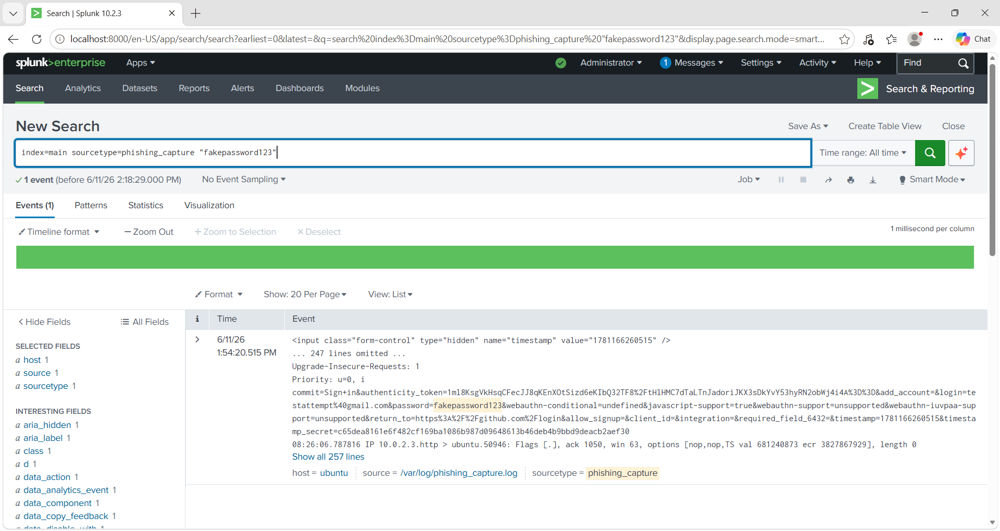
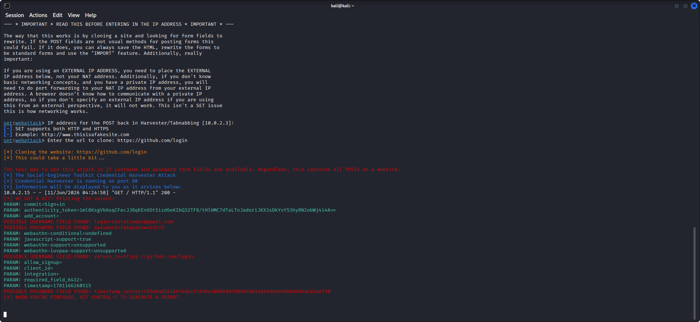

<div align="center">

```
██████╗ ██╗  ██╗██╗███████╗██╗  ██╗██╗███╗   ██╗ ██████╗
██╔══██╗██║  ██║██║██╔════╝██║  ██║██║████╗  ██║██╔════╝
██████╔╝███████║██║███████╗███████║██║██╔██╗ ██║██║  ███╗
██╔═══╝ ██╔══██║██║╚════██║██╔══██║██║██║╚██╗██║██║   ██║
██║     ██║  ██║██║███████║██║  ██║██║██║ ╚████║╚██████╔╝
╚═╝     ╚═╝  ╚═╝╚═╝╚══════╝╚═╝  ╚═╝╚═╝╚═╝  ╚═══╝ ╚═════╝
```

# SOC Homelab — Phishing Credential Harvesting Simulation

**Simulated a real-world phishing attack from scratch — cloned a live login page, harvested credentials, captured network traffic, and built a SIEM detection pipeline with real-time alerting.**


</div>

---

## 📌 Project Overview

A hands-on SOC homelab simulating a **phishing credential harvesting attack** using the Social Engineering Toolkit (SET) on Kali Linux. The lab covers the full attack lifecycle — from cloning a login page to detecting the attack via **Splunk SIEM** with real-time alerting.

> **Goal:** Understand how phishing credential harvesting works at the network level, and build detection capability as a SOC analyst.

---

## 🖥️ Lab Environment

| Component | Details |
|-----------|---------|
| 🔴 **Attacker** | Kali Linux 2025.2 (VirtualBox) — `10.0.2.3` |
| 🟡 **Victim** | Ubuntu 22.04 (VirtualBox) — `10.0.2.15` |
| 🟢 **SIEM** | Splunk Enterprise 10.2.3 (Windows host) |
| 🔵 **Network** | NAT — `10.0.2.0/24` |

---

## 🛠️ Tools Used

| Tool | Purpose |
|------|---------|
| **Social Engineering Toolkit (SET)** | Phishing page cloning & credential harvesting |
| **tcpdump** | Network packet capture on victim machine |
| **Splunk Universal Forwarder** | Log shipping from Ubuntu → Splunk |
| **Splunk Enterprise** | Detection, alerting, and dashboard |

---

## ⚔️ Attack Walkthrough

### Phase 1 — Setup (Attacker)

Launched SET on Kali Linux and navigated:

```
Social Engineering Attacks
  └── Website Attack Vectors
        └── Credential Harvester Attack Method
              └── Site Cloner → https://github.com/login
```

SET cloned the GitHub login page and started a credential harvester on **port 80**.

```bash
[*] Cloning the website: https://github.com/login
[*] The Social-Engineer Toolkit Credential Harvester Attack
[*] Credential Harvester is running on port 80
[*] Information will be displayed to you as it arrives below:
```

---

### Phase 2 — Delivery (Victim)

Victim VM opened Firefox and navigated to:

```
http://10.0.2.3
```

The cloned GitHub login page was served. Victim submitted fake credentials:

- **Username:** `testattempt@gmail.com`
- **Password:** `fakepassword123`

---

### Phase 3 — Harvest (Attacker)

SET terminal captured and displayed the credentials in real-time:

```
[*] WE GOT A HIT! Printing the output:
POSSIBLE USERNAME FIELD FOUND: login=testattempt@gmail.com
POSSIBLE PASSWORD FIELD FOUND: password=fakepassword123
```



---

### Phase 4 — Detection (SOC Analyst)

**tcpdump** ran on Ubuntu during the attack:

```bash
sudo tcpdump -i enp0s3 host 10.0.2.3 -A -w /tmp/phishing.pcap
```

Capture was converted and forwarded to Splunk:

```bash
sudo tcpdump -r /tmp/phishing.pcap -A > /tmp/phishing_readable.txt
sudo cp /tmp/phishing_readable.txt /var/log/phishing_capture.log
```

Splunk ingested the log and returned **2 events showing HTTP POST /session HTTP/1.1** from `ubuntu:50946 → 10.0.2.3`.


---

## 🔍 Splunk Detection Query

```spl
index=main sourcetype=phishing_capture "POST"
```

This query surfaces HTTP POST events — the exact mechanism used to exfiltrate credentials.



---

## 🚨 Splunk Alert Configuration

| Field | Value |
|-------|-------|
| **Name** | Phishing Credentials Harvest Detected |
| **Trigger** | Number of results > 0 |
| **Severity** | 🔴 Critical |
| **Type** | Real-time |

---

## 🗺️ MITRE ATT&CK Mapping

| ID | Technique | Description |
|----|-----------|-------------|
| [T1566.002](https://attack.mitre.org/techniques/T1566/002/) | Phishing: Spearphishing Link | Victim directed to cloned login page |
| [T1056.003](https://attack.mitre.org/techniques/T1056/003/) | Input Capture: Web Portal Capture | Credentials harvested via fake form |
| [T1071.001](https://attack.mitre.org/techniques/T1071/001/) | App Layer Protocol: Web Protocols | HTTP POST used to exfiltrate credentials |

---

## 📊 Key Findings

- ✅ SET successfully cloned GitHub login page and harvested live credentials
- ✅ tcpdump captured the full HTTP POST — including plaintext username and password
- ✅ Splunk ingested network capture and detected credential submission
- ✅ Real-time Splunk alert created for future phishing detection

---

## ⚠️ Detection Gap Identified

> Standard **syslog does NOT capture browser HTTP traffic**.
> Network-layer capture (tcpdump, Zeek, or a proxy) is required to detect phishing credential submissions — a realistic SOC limitation that reinforces the need for **layered detection**.

---

## 📸 Screenshots

All screenshots are embedded inline throughout the walkthrough above. Raw files in this repo:

- `phishing_capture.png.png` — SET credential harvest output (Kali terminal)
- `HTTP POST-session.png.png` — tcpdump HTTP POST capture (Ubuntu terminal)
- `POSSIBLE USERNAME-PASSWORD FIELD FOUN....png` — Splunk events showing phishing_capture sourcetype

---

## 🔗 Related Project

[SOC Homelab — SSH Brute-Force Detection](https://github.com/rajeshdone/soc-homelab-ssh-bruteforce)

---

## 👤 Author

**rajeshdone** — SOC Homelab Series

> *Built to develop real detection skills, not just theory.*

---

<div align="center">

**⭐ Star this repo if it helped you learn something.**

</div>
